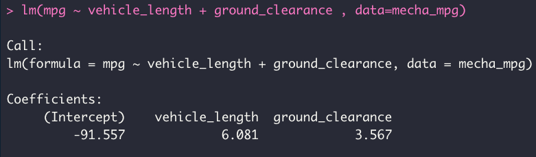
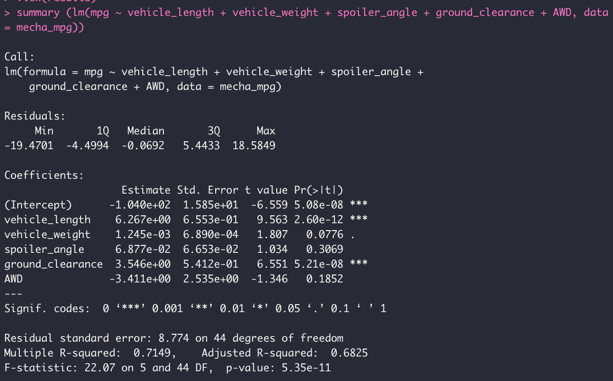
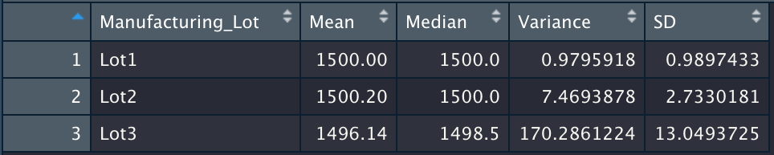
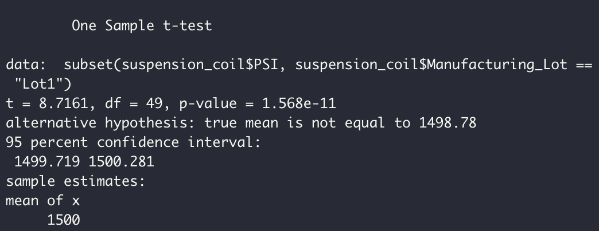
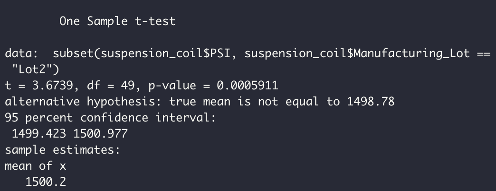
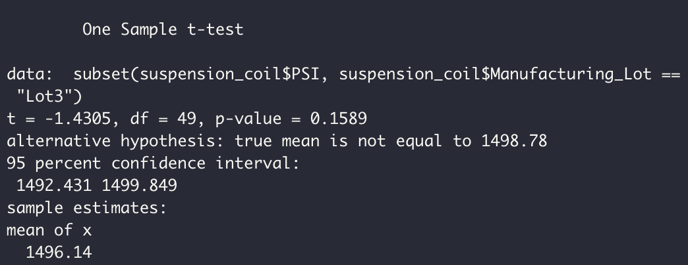

# MechaCar Statistical Analysis

## Linear Regression to Predict MPG

Working with [MerchaCar_mpg.csv](MechaCar_mpg.csv) dataset with data from 50 prototype MechaCars. These prototypes were produced based on ideal vehicle performance with some specifications.
Performing a analysis with R Language designing a linear model to predict the Miles per Gallon (MPG) using some variables and coefficients.

Using this script to calculate a **Linear Regression** was able to get below coeficents

Using this script to calculate a **Summary of Linear Regression Model** to determine **p-value adn r-squared value**.

## Summary Statistics on Suspension Coils
Now working with different dataset [Suspension_Coil.csv](Suspension_Coil.csv), where can find results of many production lots.

- **Total Summary**

- **Lot Summary**

## T-Tests on Suspension Coils

Determine if all manufacturing lots are statistically different from the population mean of 1,500 pounds per square inch.
- **Lot 1**

P value 1.568e11 is grater than 0.05 however its not significant, so the Null hypotesis can be accepted.

- **Lot 2**

P value 0.0005911 is lower than 0.05, however its significant, so the Null hypotesis can be rejected.

- **Lot 3**

P value 0.1589 is grater than 0.05 however its not significant, so the Null hypotesis can be accepted.

## Study Design: MechaCar vs Competition

The various comparable factors that MechaCar can perform against the competition would be cost,highway fuel efficiency, horse power, maintenance cost,seating capacity,PSI, mpg,ground clearence,fuel type,safety rating etc.

* We can test the highway fuel efficiency,horse power and cost.Since these metrics are directly proportional we can justify the cost of vehicle comparing to the competition.

* The null hypothesis is a statement of no difference between a sample mean or proportion and a population mean or proportion. The alternative hypothesis is a contradictory to the null hypothesis.The mean of metricA from the MechaCar can be equal or different than the mean of metricA from the competition.Using the t test we can calculate the p value and depending on this p value we can reject our null hypothesis if p value is smaller than 0.05 and support the alternative hypothesis or accept the null hypothesis and reject the alternative hypothesis.

* Since we are comparing the means from two populations we can use two sample t test. Further as we want to know whether one population mean is greater than or less than the other, we can perform a one-tailed t-test.